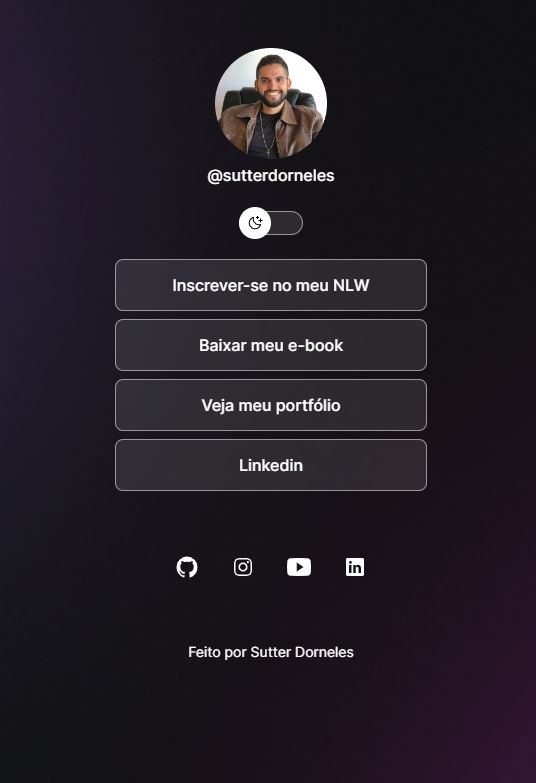

<h1 align="center"> Site de links de Sutter Dorneles</h1>

Programa exclusivo e gratuito, promovido por Sutter Dorneles, seguindo instruções do curso da Rocketseat, para divulgação das redes sociais.  
<a href="https://lp.rocketseat.com.br/devlinks/inscricao?utm_source=github&utm_medium=descricao&utm_campaign=capture-devlinks&utm_term=organic&utm_content=descricao-github-mayk-brito">Estude esse projeto em formato de vídeo clicando aqui.</a>

  <a href="#-tecnologias">Tecnologias</a>&nbsp;&nbsp;&nbsp;|&nbsp;&nbsp;&nbsp;
  <a href="#-projeto">Projeto</a>&nbsp;&nbsp;&nbsp;|&nbsp;&nbsp;&nbsp;
  <a href="#-layout">Layout</a>&nbsp;&nbsp;&nbsp;|&nbsp;&nbsp;&nbsp;
  <a href="#memo-licença">Licença</a>

  

 

  

## 🚀 Tecnologias

Esse projeto foi desenvolvido com as seguintes tecnologias:

- HTML e CSS
- JavaScript
- Git e Github
- Figma

## 💻 Projeto - Visão Geral

Esse projeto é de um site que funciona como um agregador de outros sites, permitindo aos usuários acessar e descobrir conteúdo relevante de diversas fontes em um único lugar. É um projeto open source desenvolvido com o objetivo de fornecer uma plataforma intuitiva e personalizável para os usuários explorarem uma variedade de recursos online.

## 🔖 Layout

Você pode visualizar o layout do projeto através [DESSE LINK](https://www.figma.com/community/file/1187422022288947321). É necessário ter conta no [Figma](https://figma.com) para acessá-lo.

Licença

Esse projeto está sob a licença MIT.

---

Feito com ♥ by Sutter
